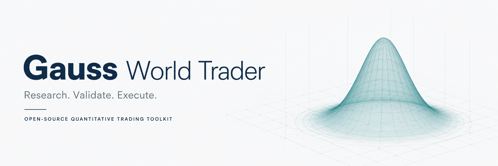
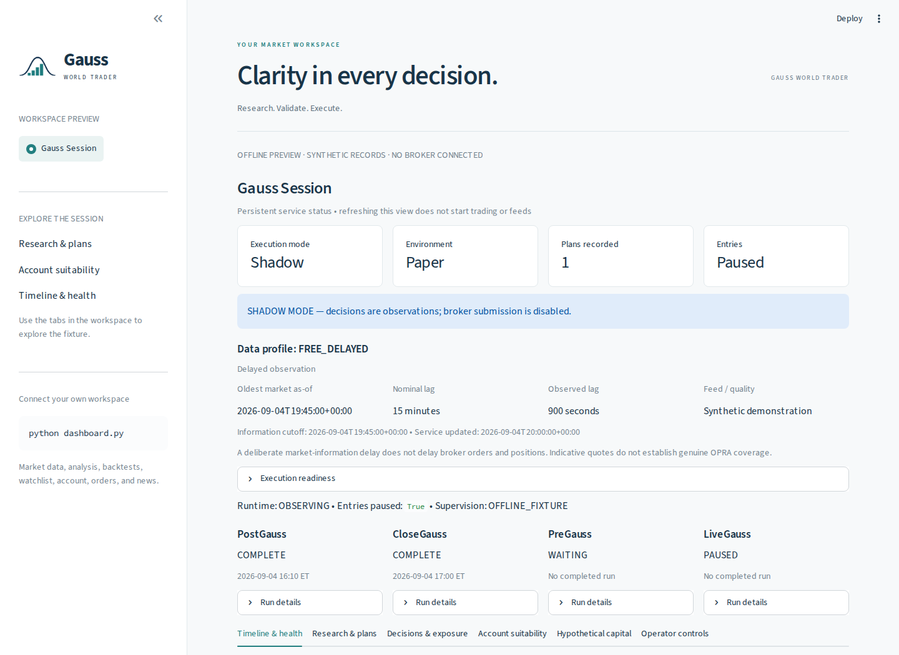
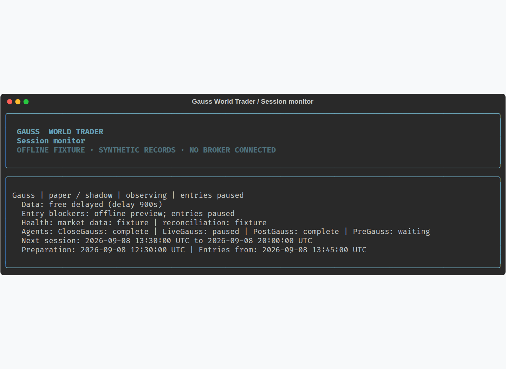

<div align="center">
  
  <p><strong>A connected Python workspace for market research, strategy backtesting, and supervised trading.</strong></p>
  <p>
    <a href="https://magica-chen.github.io/GaussWorldTrader/">Explore the website</a> ·
    <a href="#try-the-workspace">Try the workspace</a> ·
    <a href="docs/FOUR_AGENT_OPERATIONS.md">Operations guide</a> ·
    <a href="examples/README.md">Examples</a>
  </p>
  <p>
    
    
    
    
    <a href="https://join.slack.com/t/gaussianprocessmodels/shared_invite/zt-5acinu03-qvIOXiqSX0tvQmwPL2D7Nw">
      
    </a>
  </p>
</div>

Gauss World Trader brings price history, technical signals, news, and economic data into
one research process. Explore **stocks, crypto, and options**, inspect a strategy's
behavior, and follow an approved session from research through supervision. Start
with the included basic strategies, then [build your own](#build-your-own-strategy)
using the shared data, backtesting, and execution components.

| Research | Validate | Execute & supervise |
|---|---|---|
| Screen a market universe and build a next-session watchlist. | Run backtests, walk-forward tests, and account suitability checks. | Inspect plans, entry blockers, agent health, and account exposure. |
| Alpaca · Finnhub · FRED | Your strategy logic · shared backtesting | Four session roles · audited controls |

## Try the workspace

After [installing the dependencies](#installation), explore the real session interface
with synthetic records. **No API keys or broker connection required.**

```bash
python -m streamlit run examples/dashboard_preview.py
```

[](https://magica-chen.github.io/GaussWorldTrader/#workspace)

*Actual application capture. The offline preview uses synthetic account and session
records; the connected dashboard has eight sections for sessions, market data,
accounts, analysis, watchlists, backtests, orders, and news.*

<details>
<summary><strong>See the terminal experience</strong></summary>



The terminal shows session state, data freshness, entry blockers, and scheduled roles.
Use `--output json` for complete structured records. The main CLI also provides a
formatted strategy library, and `live_script.py` walks through account and strategy setup.

</details>

## Choose a workflow

Run commands from the repository root with your Python environment activated.

| Workflow | Command | Behavior |
|---|---|---|
| One-shot market research | `python gauss_bot.py --config examples/gauss.free-delayed.example.toml --once` | Discovers symbols, screens strategies, writes a next-session report, then exits |
| Continuous Gauss session | `python gauss_bot.py --config examples/gauss.free-delayed.example.toml` | Runs the four session roles and supervises account exposure; defaults to shadow execution |
| Web dashboard | `python dashboard.py` | Opens the Streamlit server at `http://localhost:3721` |
| Interactive trading setup | `python live_script.py` | Configures stock/crypto execution and options research |
| General CLI | `python main_cli.py --help` | Signals, backtests, account information, market streams, and session commands |

One-shot research submits no orders and does not start monitoring. The continuous
service's `shadow` mode records proposed actions without submitting orders. Selecting
a paper account and enabling paper order execution are separate settings.

## Installation

Use Python 3.12 or newer. The account ownership checks use POSIX file locks; run the
session runtime on Linux/macOS, or in Linux through WSL on Windows.

```bash
git clone https://github.com/Magica-Chen/GaussWorldTrader.git
cd GaussWorldTrader
conda create -n gaussworldtrader python=3.13
conda activate gaussworldtrader
python -m pip install -r requirements.txt

# On a new checkout, create and edit your local credentials file.
cp .env.example .env

# Verify the CLI without submitting orders.
python main_cli.py list-strategies
```

Use `python -m pip` so dependencies go into the same environment as the entry points.
The dependency files include Alpaca-py, Streamlit 1.54+, Plotly, vectorbt, TA-Lib,
Finnhub, and FRED clients. An editable development install is available with
`python -m pip install -e '.[dev]'`; it also installs `gauss-bot`, `trading-cli`, and
`trading-dashboard` console commands.

## One-shot market research

```bash
python gauss_bot.py --config examples/gauss.free-delayed.example.toml --once
```

The example selects `momentum`, `trend_following`, and `mean_reversion`. With
`symbols = []`, the scanner discovers active tradable US equities from Alpaca,
including eligible ETFs. It excludes OTC listings and names identifying leveraged or
inverse products, warrants, preferred shares, or rights.

The screen requires a price of at least $5 and average recent dollar volume of at
least $20 million. It analyzes up to the 200 most liquid qualifying names using
completed daily bars, requires at least 60 bars per name, and ranks BUY candidates by
signal count and then 20-session dollar volume. The report states actual coverage;
the entire discovered universe is screened, while deeper analysis uses the shortlist.

The output includes conditional entry, maximum-entry, stop, and target levels; current
news links; event-calendar coverage; and a next-session plan. Holidays and weekends
use the latest completed session and the next scheduled opening. These are research
scenarios, not strategy execution approvals or estimates of validated profitability.
Intraday triggers still require fresh data when acted on.

By default, each run writes to `results/gauss/research/<timestamp>/`:

- `report.md` — readable watchlist and plan.
- `report.json` — coverage, rankings, scenarios, news, and calendar details.
- `universe.json` — selected screening universe.
- `screen.csv` and `history.csv` — the bars used for screening and deeper analysis.

Use `--symbols AAPL,MSFT` to narrow the universe or `--output json` for structured
output. Both are optional. The research directory follows the configured evidence
parent directory when storage paths change.

**Two different `--once` commands:** `gauss_bot.py --once` runs read-only research and
exits even when the account has positions. `main_cli.py session run --once` runs a
supervision cycle and may continue managing unresolved exposure.

## Continuous four-role sessions

The persistent service schedules four responsibilities around the exchange calendar:

| Role | Responsibility |
|---|---|
| PostGauss | Review completed-session evidence and screen candidates |
| CloseGauss | Research conditional plans from frozen evidence |
| PreGauss | Validate plans, funds, permissions, data, and event readiness |
| LiveGauss | Evaluate entry triggers and supervise positions during the session |

```bash
python main_cli.py session validate-config --config examples/gauss.free-delayed.example.toml
python gauss_bot.py --config examples/gauss.free-delayed.example.toml

# In another terminal, inspect the same configured database.
python main_cli.py session status --config examples/gauss.free-delayed.example.toml
python main_cli.py session plans --config examples/gauss.free-delayed.example.toml
python main_cli.py session report --config examples/gauss.free-delayed.example.toml --format markdown
```

Continuous research uses configured stock underlyings; it does not automatically run
the whole-market discovery performed by `gauss_bot.py --once`. Stock holdings remain
included in collection and supervision. Add `--symbols` or configure `GAUSS_SYMBOLS`
when selecting a continuous research universe.

`FREE_DELAYED` uses consolidated SIP history at least 900 seconds old, plus an
entitlement-boundary buffer. `SUBSCRIBED_REALTIME` requires verified endpoint access.
Account reconciliation and received safety events use current information in both
profiles. See the [real-time example](examples/gauss.subscribed-realtime.example.toml).

Execution requires applicable `StrategyApproval` records, a matching strategy allowlist,
current account facts, and the plan's risk/data gates. The example's research allowlist
alone does not grant approval. Options entries are disabled in the example. Live
execution additionally requires the intended account, live enablement, and an audited
arming decision. Read the [operations guide](docs/FOUR_AGENT_OPERATIONS.md) and
[validation requirements](docs/FOUR_AGENT_VALIDATION.md) before enabling execution.

### Display and shutdown

Terminal output shows health, agent states, entry blockers, and session times, with a
short heartbeat between changes. Use `--output text` or `--output json` to select a
format explicitly; redirected continuous output defaults to JSON.

Press **Ctrl+C** to request shutdown. If residual or unverified exposure remains, the
service reports it and continues management. **After that notice**, another Ctrl+C
acknowledges ending supervision with exposure. This does not liquidate positions or
cancel every broker order. Entry pauses persist across restarts.

An abrupt exit can leave a database lease for up to 120 seconds after its last renewal.
A blocked restart reports the lease expiry and exits. Keep the database intact and
retry after expiry once the previous process has stopped.

## Dashboard and interactive trading

```bash
python dashboard.py
python live_script.py
```

The dashboard includes Gauss Session, Market Overview, Account Info, Live Analysis,
Watchlist, Strategy Backtest, Trade & Order, and News & Report views. The Gauss Session
view reads the service ledger and offers authenticated controls; opening the browser
does not start the service. Other views can fetch data or perform explicitly selected
account actions.

See the [workspace preview above](#try-the-workspace) or the [interactive website](https://magica-chen.github.io/GaussWorldTrader/#workspace).

The interactive CLI supports quick-start watchlist defaults and custom asset,
strategy, and parameter selection. Stock and crypto execution follows the reviewed
configuration. **Options in this menu run underlying research only**, with no option
orders or automatic exits; automated option execution belongs to the gated Gauss
session workflow.

Multi-symbol live runs share a websocket per asset type. Mixed asset types run
sequentially; Ctrl+C advances to the next group. Defaults come from typed watchlist
entries and current positions, with asset-specific defaults when those are empty.
Legacy automated order paths reject submissions when the Gauss service owns the
same account/environment.

## Strategies, analysis, and backtesting

The included basic strategies are starting points for learning the interfaces,
trying ideas, and developing your own approach. Adapt an example or implement a
new strategy using the shared contracts.

| Asset type | Included strategy examples |
|---|---|
| Stock | `momentum`, `trend_following`, `mean_reversion`, `value`, `scalping`, `statistical_arbitrage`, `macro_factor`, `multi_agent` |
| Crypto | `crypto_momentum`, `btc_volatility_breakout` |
| Option | `wheel`, `vertical_spread` |

`crypto_momentum` is a factory alias for `MomentumStrategy` with crypto defaults.
The one-shot daily screen supports the three strategies listed in its example;
registry membership does not imply support in every workflow. Option strategies are
excluded from the general dashboard strategy picker.

```bash
python main_cli.py run-strategy --strategy momentum AAPL MSFT --days 90
python main_cli.py backtest --strategy mean_reversion AAPL --days 365
python main_cli.py backtest --strategy trend_following AAPL --days 365 --walk-forward --splits 4
python main_cli.py backtest --strategy multi_agent AAPL --days 120 -p mode=fast
python main_cli.py stream-market --asset-type crypto --symbols BTC/USD,ETH/USD
```

`run-strategy` prints signals by default; `--execute` enables its order path.
Stock/crypto backtests use vectorbt; options use the event-loop backtester.

The `multi_agent` stock strategy combines technical, fundamental, sentiment, risk,
and decision agents. Its `fast` mode uses deterministic analysis; `llm` mode calls a
configured provider. This analyst committee is separate from the four session roles.
Dashboard multi-agent backtests use `fast` mode. Optional paid research in the session
service uses isolated workers, recorded model pricing, and bounded time/cost budgets.

### Build your own strategy

1. Add your strategy to the appropriate asset package in `src/strategy/`. Define
   `meta` and `summary`, then implement `get_signal()` and `get_action_plan()` using
   the [shared strategy contracts](src/strategy/base.py).
2. Register it in [the strategy registry](src/strategy/registry.py) so the CLI and
   applicable dashboard views can discover it.
3. Test it with your intended research, backtest, or execution workflow. Connect
   the required adapters and approvals when adding it to the session runtime.

See [Extending the project](docs/PROJECT_STRUCTURE.md#extending-the-project) for
integration details. You supply the strategy logic; the shared components handle
data access, backtesting, and execution policy.

<details>
<summary><strong>Configuration and data sources</strong></summary>

## Configuration and data sources

Credentials are loaded from the environment and local `.env`. Session configuration
uses `[gauss]` in the selected TOML file. `GAUSS_*` environment values override TOML;
explicit bot CLI mode/profile/symbol arguments override the loaded configuration.
An explicitly blank `GAUSS_SYMBOLS` or `GAUSS_STRATEGY_ALLOWLIST` clears the corresponding
TOML list. The one-shot scanner uses its three default strategies when its list is empty.

| Setting | Purpose |
|---|---|
| `ALPACA_API_KEY`, `ALPACA_SECRET_KEY` | Broker credentials and entitled market data |
| `ALPACA_BASE_URL` | Paper/live endpoint for general account and interactive trading paths |
| `FINNHUB_API_KEY` | Earnings calendar, company news, and supported fundamentals |
| `FRED_API_KEY` | Economic series and scheduled release dates |
| `GAUSS_CONFIG` | Default session TOML path; alternatively pass `--config` |
| `GAUSS_MODE`, `GAUSS_ENVIRONMENT` | Session execution mode and paper/live account environment |
| `GAUSS_DATABASE_PATH` | Shared session database; default `results/gauss/session.sqlite3` |
| `GAUSS_ACCOUNT_ID` | Intended account identity; blank allows broker discovery |
| `GAUSS_SYMBOLS`, `GAUSS_STRATEGY_ALLOWLIST` | Comma-separated universe and strategy selection |
| `GAUSS_CONTROL_TOKEN` | Private token for authenticated session commands |
| `GAUSS_EVENT_CALENDAR` | Optional verified operator calendar file overriding automatic feeds |
| Provider credentials and `MULTI_AGENT_*` | Optional LLM-backed analysis; see `.env.example` and the provider implementation |

Alpaca's calendar supplies trading sessions. Finnhub earnings and FRED release dates
supply the automatic event calendar, cached for 15 minutes with seven days of forward
coverage. FRED events are date-only. The runtime uses all-day entry restrictions for
an affected symbol's earnings and selected major economic releases; routine releases
are informational. FRED dataset updates are not inferred FOMC policy meetings.
Missing source coverage remains visible and blocks the corresponding readiness gate.
See [calendar behavior](docs/FOUR_AGENT_OPERATIONS.md#research-and-options-policy).

Typed entries in `watchlist.json` use `symbol` and `asset_type` (`stock`, `crypto`, or
`option`). Watchlist management lives in `src/watchlist/`. Notifications live in
`src/notify/`; enable email with `NOTIFICATION_EMAIL_ENABLED`, `GMAIL_ADDRESS`, and
`GMAIL_APP_PASSWORD`, or Slack with `NOTIFICATION_SLACK_ENABLED` and `SLACK_WEBHOOK_URL`.

</details>

## Repository and development

The detailed [structure guide](docs/PROJECT_STRUCTURE.md) maps every source package,
the two execution paths, generated artifacts, and strategy extension points.

```text
src/
├── runtime/     # One-shot screening and the persistent four-role service
├── strategy/    # Strategy contracts, registry, and stock/crypto/option implementations
├── trade/       # Shared/asset engines, live loops, and portfolio analytics
├── backtest/    # Vectorbt and event-loop backtesting
├── data/        # Alpaca, Finnhub, FRED, and news providers
├── account/     # Account, order, position, and configuration operations
├── agent/       # Fundamental analysis and the multi-agent analyst committee
├── llm/         # Provider adapters and usage records
├── notify/      # Email/Slack alerts and trade-fill stream handling
├── watchlist/   # Typed watchlist persistence
├── analysis/    # Technical indicators and option pricing/greeks
├── ui/          # Streamlit dashboard and shared components
└── utils/       # Symbols, timezones, and logging
```

Install development tools with `python -m pip install -e '.[dev]'`. The CI suite uses
explicit offline tests so local credential-dependent tests are excluded:

```bash
python -m pytest tests/test_four_agent*.py tests/test_execution_safety.py \
  tests/test_live_session_safety.py tests/test_gauss_existing_adapters.py \
  tests/test_runtime_operational.py tests/test_momentum_strategy.py tests/runtime tests/ui
```

CI tests Python 3.12/3.13 and builds/imports the wheel. Approved offline tests and
sanitized fixtures are tracked; other local tests remain ignored. Keep changes
focused, add behavior coverage where useful, and include screenshots for UI changes.

## Documentation

- [Brand and preview guide](docs/BRAND.md) — visual assets, screenshot reproduction, and website checks.
- [Project structure](docs/PROJECT_STRUCTURE.md) — packages, data flows, and extension points.
- [Operations](docs/FOUR_AGENT_OPERATIONS.md) — configuration, controls, calendars, shutdown, and recovery.
- [Validation](docs/FOUR_AGENT_VALIDATION.md) — evidence and deployment requirements.
- [Acceptance matrix](docs/FOUR_AGENT_ACCEPTANCE_MATRIX.md) — requirement-to-test mapping.
- [Examples](examples/README.md) — signal, backtest, and options examples.
- [Implementation plan](docs/GaussWorldTrader_Four_Agent_Implementation_Plan_v1_1.md) — design reference; executable behavior is defined by the current code.

Read [DISCLAIMER.md](DISCLAIMER.md) before using trading or investment-related
features. Released under the [MIT license](LICENSE).

## Community

Join the [Gauss World Slack](https://join.slack.com/t/gaussianprocessmodels/shared_invite/zt-5acinu03-qvIOXiqSX0tvQmwPL2D7Nw) or use [GitHub issues](https://github.com/Magica-Chen/GaussWorldTrader/issues) for bugs and feature requests.

<details>
<summary>Star history</summary>

<a href="https://www.star-history.com/?type=date&legend=top-left&repos=Magica-Chen%2FGaussWorldTrader">
 <picture>
   <source media="(prefers-color-scheme: dark)" srcset="https://api.star-history.com/chart?repos=Magica-Chen/GaussWorldTrader&type=date&theme=dark&legend=top-left" />
   <source media="(prefers-color-scheme: light)" srcset="https://api.star-history.com/chart?repos=Magica-Chen/GaussWorldTrader&type=date&legend=top-left" />
   
 </picture>
</a>

</details>
