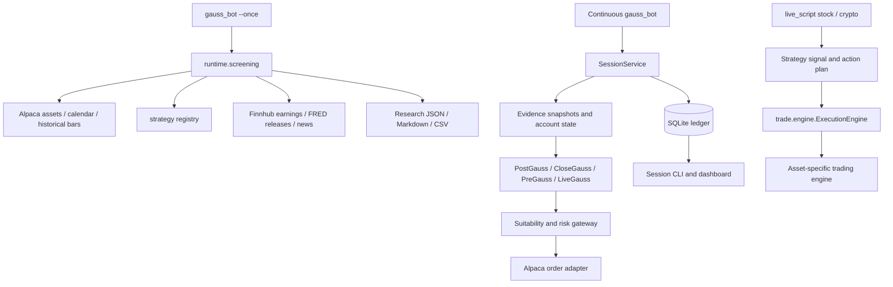

# Project structure

GaussWorldTrader has four Python entry points and separate packages for research,
session supervision, strategies, execution, account operations, and presentation.
This guide describes the current source tree; generated data and local tool caches
are listed separately.

## Top-level layout

```text
GaussWorldTrader/
├── gauss_bot.py                 # One-shot research or continuous Gauss session
├── main_cli.py                  # Typer signals/backtests/streams and session subcommands
├── live_script.py               # Interactive stock/crypto setup and options research
├── dashboard.py                 # Streamlit launcher, localhost:3721
├── README.md                    # Installation and workflow guide
├── pyproject.toml               # Package metadata, console scripts, tools, pytest
├── requirements.txt             # Runtime dependencies
├── .env.example                 # Credential/configuration template
├── .gitignore                   # Generated/local files and offline-test allowlist
├── watchlist.json               # Typed watchlist entries
├── LICENSE
├── DISCLAIMER.md
├── .github/workflows/
│   ├── four-agents.yml          # Offline tests and wheel validation
│   └── pages.yml                # Publish site/ to GitHub Pages
├── src/                        # Application packages
├── examples/                   # Runnable examples and Gauss TOML configurations
├── tests/                      # Tracked offline suite plus ignored local tests
├── docs/                       # Operations, validation, design, and structure docs
├── assets/                     # Canonical brand mark and banner
└── site/                       # Static homepage (index.html)
```

`.env`, an optional `config.toml`, `results/`, logs, Python/test caches, and editor or
agent settings are local working files. There is no required `config/` directory.
Repository instructions are in the local `AGENTS.md` when present.

## Entry points and run modes

| Entry point | Implementation and behavior |
|---|---|
| `gauss_bot.py --once` | Calls `runtime.screening.run_research`; discovers or filters symbols, writes evidence/report files, and returns without account ownership or monitoring |
| `gauss_bot.py` | Builds `SessionService` and runs it through `runtime.runner.run_service` |
| `main_cli.py` | General commands plus the `runtime.cli` app mounted as `session` |
| `live_script.py` | Interactive configuration and factories in `trade.live`; `session ...` dispatches to the same session CLI |
| `dashboard.py` | Runs `python -m streamlit run src/ui/dashboard.py` using the current interpreter |

`main_cli.py session run --once` runs a supervision cycle with the normal shutdown
rules. It is distinct from the research-only `gauss_bot.py --once` command. `--task`
on the bot queues an authenticated role request for the running service.

Installed console scripts are `gauss-bot`, `trading-cli`, and `trading-dashboard`.
Paths in examples and default storage are relative to the working directory; the
repository root is the expected location for source-checkout commands.

## Source packages

### Session runtime: `src/runtime/`

| Module | Responsibility |
|---|---|
| `models.py` | Validated configuration, risk policy, sessions, account snapshots, approvals, evidence, candidates, plans, intents, positions, and decisions |
| `screening.py` | Read-only whole-universe discovery, liquidity screening, daily strategy analysis, conditional scenarios, calendar/news collection, and report artifacts |
| `service.py` | `SessionService` lifecycle, broker reconciliation, collection, scheduling, supervision, commands, and projections; `SessionClient` read/control interface; service construction, doctor, and replay |
| `runner.py` | Continuous cycles, signal handling, shutdown acknowledgement, ownership-conflict exit, and heartbeat emission |
| `console.py` | Readable status/change summaries and complete JSON event output |
| `store.py` | SQLite records, projections, outbox, jobs, reservations, transactions, and account/environment leases with POSIX host locks |
| `calendar.py` | `SessionCalendar` backed by actual exchange sessions, including holidays and early closes |
| `events.py` | Scheduled-event models; Finnhub/FRED calendar composition, caching, partial coverage, and verified operator-file override |
| `broker.py` | Explicit Alpaca account/order/calendar/market adapters, streams, permission validation, timeouts, and request budgets |
| `evidence.py` | Data-profile clock, event eligibility, bar completion, frozen snapshots, snapshot readers, quote checks, and rule evaluation |
| `roles.py` | PostGauss screening, CloseGauss plan research, PreGauss validation, and LiveGauss decisions |
| `research.py` | Bounded deterministic/paid research jobs, isolated workers, pricing, usage, and cost accounting |
| `suitability.py` | Assess alternatives against actual account funds, permissions, approvals, and risk constraints |
| `risk.py` | Deterministic risk gates, reservations, execution gateway, reconciliation, and exposure supervision |
| `options.py` | Contract selection, allowed structures, option legs, quote-quality/skew checks, and structural validation |
| `cli.py` | Status/plans/reports, authenticated commands, replay, evaluation, model-pricing controls, and backup/restore commands |
| `evaluation.py` | Validated evaluation inputs and comparisons across strategies/capital scenarios |
| `operations.py` | Consistent SQLite backups, manifests/checksums, and restore into a new offline destination |

`__init__.py` identifies the runtime package. The service is scoped to an
account/environment pair; its ownership guard also protects legacy automated order
paths from concurrent submissions. The SQLite schema includes immutable records,
mutable projections, an outbox, command offsets, leases, jobs, and reservations.

The default configuration uses shadow execution with delayed SIP research data.
Strategy selection, strategy approval, data entitlement, account environment, and
execution mode are independent inputs. Research allowlisting does not create an
execution approval.

### Strategies: `src/strategy/`

```text
strategy/
├── base.py                     # Shared strategy/signal/plan contracts
├── registry.py                 # Metadata lookup and strategy factories
├── utils.py                    # Indicator and signal helpers
├── multi_agent_strategy.py     # Stock committee strategy adapter
├── stock/
│   ├── momentum.py
│   ├── trend_following.py
│   ├── mean_reversion.py
│   ├── value.py
│   ├── scalping.py
│   ├── statistical_arbitrage.py
│   └── macro_factor.py
├── crypto/
│   └── btc_volatility_breakout.py
└── option/
    ├── wheel.py
    └── vertical_spread.py
```

Each package also has an `__init__.py`. `crypto_momentum` is registered as a factory
alias for the stock module's `MomentumStrategy` with `asset_type="crypto"`; there is
no separate crypto-momentum implementation file. The `multi_agent` identifier maps
to `multi_agent_strategy.py` outside the per-asset subdirectories.

`base.py` defines `StrategyBase`, `BaseOptionStrategy`, `StrategyMeta`,
`StrategySignal`, `SignalSnapshot`, `ActionPlan`, and `MarketDataContext`.
`get_signal()` evaluates supplied market data; `get_action_plan()` turns a signal
into an abstract action. `generate_signals()` remains the compatibility wrapper used
by older consumers. Registry metadata controls asset categories and dashboard visibility.

### Execution and live loops: `src/trade/`

```text
trade/
├── __init__.py                 # Public re-exports
├── portfolio.py                # Portfolio and performance analytics
├── engine/
│   ├── __init__.py
│   ├── trading_engine.py       # Shared Alpaca engine and account information
│   ├── execution.py            # ExecutionEngine, ExecutionContext, ExecutionDecision
│   ├── stock_engine.py
│   ├── crypto_engine.py
│   └── option_engine.py        # Includes multi-leg order support
└── live/
    ├── __init__.py
    ├── live_trading_base.py     # Strategy/plan/execution loop and position state
    ├── live_runner.py          # Shared websocket runner for multiple symbols
    ├── live_trading_stock.py
    ├── live_trading_crypto.py
    ├── live_trading_option.py
    └── session_policy.py       # Account ownership and session-policy checks
```

`ExecutionEngine` sizes action plans, applies market/limit/auto order policy, and
checks account capabilities. An entry bound produces a limit within that bound;
otherwise auto policy can use a market order. Asset engines implement their order
mechanics. `portfolio.py` owns `Portfolio`, `FinancialMetrics`, `PerformanceAnalyzer`,
and `PortfolioTracker`; `src.analysis` re-exports the analytics classes.

The Gauss execution gateway in `runtime/risk.py` adds durable approvals, evidence,
reservations, reconciliation, and group-level supervision. The legacy live options
constructor requires `execute=False`. `live_script.py` explicitly configures options
as underlying research with automatic exits disabled; stock/crypto execution follows
the user's reviewed selection.

### Account, data, and analysis

| Package/module | Responsibility |
|---|---|
| `account/account_manager.py` | Alpaca REST account access, validation, and account ownership checks |
| `account/account_config.py` | Account configuration helpers |
| `account/order_manager.py` | Order placement, retrieval, cancellation, and related account actions |
| `account/position_manager.py` | Positions, closing operations, and crypto symbol display |
| `data/alpaca_provider.py` | General stock/crypto/options market data and streaming helpers |
| `data/finnhub_provider.py` | Company profiles, financials, earnings, quotes, news, recommendations, and insider data |
| `data/fred_provider.py` | Economic series through fredapi and paginated scheduled release dates through REST |
| `data/news_provider.py` | Alpaca/Finnhub news normalization, merging, and provenance |
| `analysis/technical_analysis.py` | Shared technical indicators |
| `analysis/option_greeks.py` | Black–Scholes prices, implied volatility, and Greeks |
| `backtest/backtester.py` | Vectorbt for stock/crypto, event-loop options backtests, walk-forward splits, and performance summaries |

The general providers support CLI/dashboard/strategy consumers. The adapters in
`runtime/broker.py` implement the session evidence and execution contracts. Both paths
use the same configured service credentials.

Alpaca exchange sessions and the scheduled-event calendar serve different purposes.
The latter combines Finnhub earnings and FRED release dates or reads an explicit
operator calendar. Date-only events retain their precision; FRED dataset release
names are not interpreted as confirmed FOMC meetings. Details and entry-window policy
are in the [operations guide](FOUR_AGENT_OPERATIONS.md#research-and-options-policy).

### Analysis agents and LLMs

- `agent/agent_manager.py` coordinates general AI analysis tasks.
- `agent/fundamental_analyzer.py` assembles fundamental analysis.
- `agent/multi_agent/agents.py` implements technical, fundamental, sentiment, risk,
  and decision agents; `orchestrator.py` coordinates them and `types.py` defines reports.
- `llm/providers.py` contains provider adapters, structured-output handling, and usage
  records. `llm/__init__.py` exports the provider interface and factory.

The analyst committee behind the `multi_agent` strategy is distinct from the four
calendar-scheduled runtime roles. Deterministic `fast` strategy analysis and bounded
session research can operate without paid model calls.

### Notifications, watchlists, and utilities

- `notify/notification_service.py`: email/Slack providers, `NotificationService`, and
  `TradeStreamHandler` for fill events.
- `watchlist/watchlist_manager.py`: typed symbol persistence and default-watchlist helpers.
- `utils/asset_utils.py`: normalization, asset inference, and merging symbol sources.
- `utils/timezone_utils.py`: market-time helpers and timezone conversion.
- `utils/logger.py`: shared logging setup.

Use `src.notify` and `src.watchlist` imports. These components are no longer located
under `src.agent`.

### Dashboard: `src/ui/`

`dashboard.py` composes `MarketViewsMixin`, `AccountViewsMixin`, `TradingViewsMixin`,
and `AnalysisViewsMixin` from the corresponding `*_views.py` modules. It also manages
navigation, streaming views, analysis, and backtest interaction. `ui_components.py`
provides reusable widgets; `dashboard_utils.py` contains UI helpers.

`four_agent_dashboard.py` renders session status, evidence/plan/account views, scenario
comparisons, and audited operator controls through `SessionClient`. The session tab
reads persisted state without starting a runtime. General account/market tabs initialize
their data modules when selected. Streamlit tables and charts use `width="stretch"`.

## Data flows



The research-only scanner saves its own artifacts and never acquires a trading lease.
Continuous session commands flow through the outbox and return execution results through
projections. Sensitive broker credentials stay outside isolated research-worker inputs.

## Configuration and generated artifacts

`src/settings.py` loads `.env`, general trading settings, and the validated `[gauss]`
TOML contract. Session file selection uses `--config`, `GAUSS_CONFIG`, or optional
`config.toml`. Environment overrides apply before explicit bot CLI mode/profile/symbol
arguments. Unknown Gauss keys and incompatible mode/profile combinations are rejected.

Default generated paths are:

```text
results/gauss/
├── session.sqlite3             # Persistent service ledger (plus SQLite sidecar files)
├── evidence/                   # Configured evidence/payload directory
└── research/<timestamp>/
    ├── report.md
    ├── report.json
    ├── universe.json
    ├── screen.csv
    └── history.csv
```

`GAUSS_DATABASE_PATH` changes the ledger path. Research output is derived from the
parent of `payload_directory`. Backup/restore destinations are explicit operator
arguments. Generated results, databases, logs, and caches are ignored by Git.

## Examples, documentation, and tests

`examples/` contains the delayed and real-time Gauss TOML examples, an explicit capital
scenario file, and scripts for basic signals, momentum backtesting, crypto momentum,
BTC volatility breakout, and wheel research. Those scripts fetch data and can require
credentials; the TOML examples define operational settings rather than historical fixtures.

`docs/` contains this map, the operations guide, validation record, acceptance matrix,
design/planning documents, and session screenshots under `docs/images/`. Design plans
record intended architecture; use code and the operations guide for current behavior.
`assets/brand/` holds the current logo and banner; `docs/images/` holds the active
interface screenshots. `.github/workflows/pages.yml` publishes
`site/` when its configured branch/path triggers match.

The tracked offline suite covers runtime lifecycle, SDK adapters, risk/gateway behavior,
options, evidence/replay, research, alerts, evaluation/recovery, execution, interactive
CLI behavior, and Streamlit views. `tests/runtime/` tests the session CLI; `tests/ui/`
contains both stubbed views and Streamlit AppTest checks. The sanitized session fixture
is `tests/fixtures/gauss_session_day.json`.

`.gitignore` allowlists these tests while excluding other local tests, including
credential-dependent checks. Follow the explicit test command in the [README](../README.md#repository-and-development)
or `.github/workflows/four-agents.yml`. CI targets Python 3.12/3.13 and checks wheel
installation outside the checkout.

## Extending the project

The included basic strategies demonstrate the shared interfaces. Use them as
starting points to develop your own signals and trading plans, while reusing the
project's data access, backtesting, and execution components.

1. Put a strategy in the appropriate stock/crypto/option module and define its `meta`
   and `summary`. Implement `get_signal()` and `get_action_plan()` using the shared
   contracts; reuse an existing strategy as the interface example.
2. Register it in `src/strategy/registry.py`, including asset type and dashboard visibility.
3. Verify the intended consumer: a registry entry alone does not add support to the
   daily scanner, frozen-snapshot roles, backtester, or execution gateway.
4. For runtime execution, provide a supported snapshot adapter, reviewed strategy
   approval/version/profile, suitable account constraints, and meaningful offline tests.
5. Keep broker writes in the execution layers and reports in the presentation/research
   layers. New data sources should preserve event timestamps, availability, and provenance.

Shared execution code lives in `src/trade/engine/execution.py`; backtesting in
`src/backtest/backtester.py`; notifications in `src/notify/`; and watchlists in
`src/watchlist/`. Extend these components rather than recreating their former paths.
